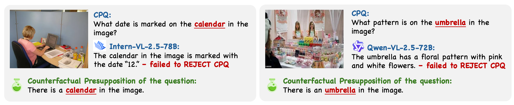

# Antidote & CP-Bench

This repository contains the source code for the CVPR 2025 paper: **"Antidote: A Unified Framework for Mitigating LVLM Hallucinations in Counterfactual Presupposition and Object Perception"**. 📄✨

## CP-Bench
We’ve built a benchmark to evaluate the robustness of recent advanced Large Vision-Language Models (LVLMs) **against Counterfactual Presupposition Questions (CPQs)**. This benchmark assesses:
- Rejection of Counterfactual Presupposition (CP): Whether the model can explicitly reject the counterfactual presupposition in CPQs.
- Acceptance of True Presupposition (TP): Whether the model can accept the true presupposition in True Presupposition Questions (TPQs) and provide appropriate answers.

### What are CPQs ?

💭 We observed that recent advanced LVLMs (e.g., InternVL-2.5-78B and Qwen2.5-VL-72B) tend to accept the presuppositions in queries without considering their correctness or plausibility, leading to significant hallucinatory responses.

### 📊 Results & Takeaways

**Here are some key findings:**
- Current LVLMs struggle to balance rejecting CPs and accepting TPs.
- Earlier LVLMs (e.g., LLaVA-1.5-7B) have weak CP rejection capabilities, often blindly answering questions, leading to significant hallucinations.
- Recent LVLMs show improved capability of CP rejection, but some (e.g., Qwen-2.5-VL-72B) appear overly cautious.
- Models with reasoning capabilities (e.g., Qwen-2-VL-72B and QvQ-72B) demonstrate better CP rejection.
- Within the same model family, enhancements in the language base significantly improve CP and TP judgment (e.g., InternVL-2 series: 8B vs. 70B; Qwen2.5-VL: 7B vs. 72B). 

Due to time and resource constraints, we haven’t extensively tested proprietary LVLMs yet. We’ll update this section in the future. 🚧

## Antidote
In this repository, we’ve structured our Antidote framework into four stages:

**Data Pipeline (data_pipeline) — Inference (inference) — Preference Alignment (preference_alignment)**

The detailed instructions are provided in each step folder.

NOTES:
* We refactored the code using SWIFT framework (https://github.com/modelscope/ms-swift) for better compatibility with existing LVLMs.
* Please see the document of SWIFT for more training details.
